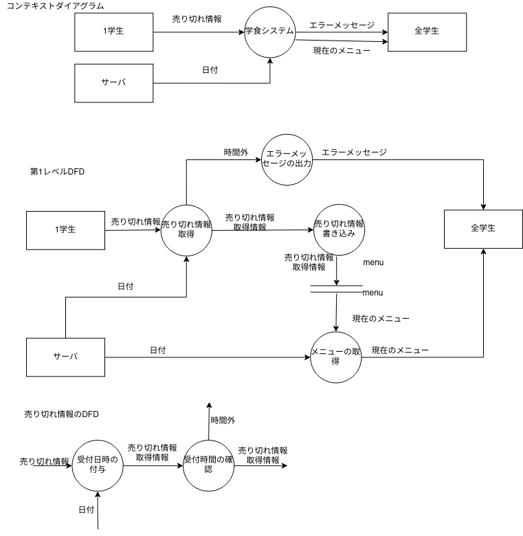

# 目的
予め、食堂のメニューの在庫状況を知ることで食券機での混雑を防ぐ
# システムの機能要件
* スマートフォンのブラウザ上で動作する。
* 対象とするメニューは食堂のAセット,Bセット,常設メニューとする。
* Aセット,Bセットは各日のメニューを表示する。
* 各メニューの価格を表示する。
* メニューは1月分表示する。
* 売り切れ情報を入力,表示する。
* 売り切れ情報の入力時間の制限。
* 売り切れた時間の表示。
* ユーザマニュアルの作成。
# DFD　(修正する)

# DD
* 売り切れ情報=商品名+販売状況
* 販売状況= [売り切れ—販売中]
* 売り切れ情報取得情報=売り切れ情報+取得時間+日付2
* 現在のメニュー=商品名+価格+販売状況+前日の売り切れ時間
